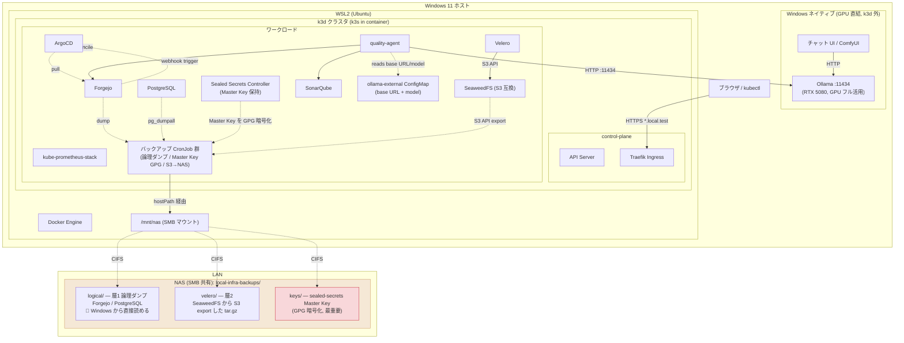

# アーキテクチャ詳細

[README](../README.md) の続編にあたる**設計文書**。本インフラ (Windows 11 + WSL2 + k3d 上の GitOps 構成) が「どう組まれているか」と「なぜその構成にしたか」を記述する。扱う範囲は、全体構成図・レイヤ別コンポーネント・GitOps (App-of-Apps) 設計・Bootstrap 戦略・ネットワーク / DNS・Ollama (Windows ネイティブ) 接続・Secret 管理方針・監視戦略・リソース見積もり。

**目的**: 構成変更・コンポーネント追加・マシン移行の前に、全体像と設計判断の理由を 1 箇所で把握できる状態を保つ。

**対象読者**: 本リポジトリを変更・運用する人 (将来の自分を含む)。Kubernetes / GitOps / Helm の基本概念は既知とする。

**いつ読むか**: 新しい Application を足すとき、ネットワークや接続方式を変えるとき、新マシンへ移行するとき、既存構成の「なぜ」を確認したいとき。日々の定型操作や障害対応はこの文書ではなく runbooks を参照する。

**関連文書との役割分担**:

- [README](../README.md) — プロジェクトの目的・設計三原則・フェーズ計画。最初に読む入口
- 本ドキュメント — 技術構成と設計判断 (how / why)。設計を変えるときに読む
- [quality-model.md](quality-model.md) — ISO/IEC 25010:2023 / 25019:2023 の品質モデルと実装ツールのマッピング。評価ロジックを扱うときはこちら
- [backup.md](backup.md) — バックアップ戦略と DR 手順。復元・移行の実作業はこちら
- [runbooks/](runbooks/) — 個別の運用手順・障害対応 (実行コマンドつき)。手を動かすときはこちら

---

## 全体構成図



要点:

- **Forgejo は自分自身を管理する Git ホスト**。`local-infra` リポジトリは Forgejo に置かれ、ArgoCD はそこを真実の源として pull する。
- **ArgoCD と Forgejo の鶏卵問題**: 初回は ArgoCD と Forgejo を手動 `helm install` で立ち上げ、その後本リポジトリを Forgejo に push し、ArgoCD の Application を Forgejo を参照するよう書き換えてセルフホスティング状態へ遷移する。手順は [Bootstrap 戦略](#bootstrap-戦略) 参照。
- **NAS は WSL2 から SMB マウント**し、論理バックアップ (層 1) の出力先として hostPath で k3d に渡す。SeaweedFS のデータ実体はクラスタ内の local-path PVC に置き、NAS へは S3 API でエクスポートする (詳細は [docs/backup.md](backup.md))。
- **NAS に入るデータは 3 種類** (これで網羅):
  1. `logical/` — 層 1 論理ダンプ (Forgejo dump / PostgreSQL pg_dumpall)。**Windows から直接読める** zip/sql.gz。Grafana / ArgoCD の個別ダンプは「Git + pg ダンプで再現可能」のため廃止 (詳細は [docs/backup.md](backup.md))。
  2. `velero/` — 層 2。Velero が SeaweedFS (local-path) に取ったバックアップを S3 API で export した tar.gz。
  3. `keys/` — **sealed-secrets Master Key を GPG 暗号化したもの (最重要)**。これを失うと Git 内の全 SealedSecret が永久に復号不能になるため、NAS と別系統 (パスワードマネージャ) で二重管理する。詳細は [docs/runbooks/sealed-secrets.md](runbooks/sealed-secrets.md)。
- **Ollama は k3d 内ではなく Windows ネイティブで動かす**。RTX 5080 (16GB) の GPU をパススルー無しでフル活用でき、Windows 側のチャット UI / ComfyUI からも同じ `:11434` を直接叩けるため。クラスタ内 (quality-agent) からは `quality-agent` ns の ConfigMap `ollama-external` (base URL + model) を読んで HTTP 接続し、マシン依存の Windows ホスト IP はこの ConfigMap 1 箇所に隔離する (ArgoCD が Endpoints/EndpointSlice を除外するため Service+Endpoints 方式は使わない)。Ollama は状態を持たない推論サーバなのでクラスタ外でも Recoverable 原則を損なわない (モデルは再 pull で復元)。実装上の注意は後述「Ollama (Windows ネイティブ) 接続」を参照。

---

## レイヤ別コンポーネント

### ホストレイヤ (Windows + WSL2)

| 要素 | バージョン目安 | 役割 |
| :--- | :--- | :--- |
| Windows 11 Pro | 26200 以降 | ベース OS |
| WSL2 + Ubuntu | 24.04 LTS | Linux 環境提供 (`local-infra` ディストリ) |
| Docker Engine | 安定版 | コンテナランタイム (WSL2 内に直接インストール。当初の Podman 案から変更、[bootstrap/00](../bootstrap/00-prerequisites.md)) |
| k3d | 5.x | k3s クラスタ管理 CLI |
| kubectl / helm | 安定版 | クラスタ操作 |

WSL2 のリソース設定 (`.wslconfig`):

```ini
[wsl2]
memory=24GB
processors=8
swap=8GB
```

(SonarQube + Prometheus + quality-agent を同時稼働させる前提。**Ollama はこの WSL2 / k3d の外 (Windows ネイティブ) で動かす**ため、GPU パススルーや VRAM 分の WSL2 メモリ確保は不要。クラスタ → Windows ホストの到達は **Windows の LAN IP** を ConfigMap に入れる (NAT GW IP は WSL 再起動で変わりうる、`networkingMode=mirrored` は k3d の公開ポートを壊す、`host.k3d.internal` は docker bridge GW を指し届かない — いずれも検証で塞がった。後述))

### クラスタレイヤ (k3d)

k3d は Docker コンテナ内で k3s を動かす方式。マルチノード構成にして本物の k8s 運用感覚を得る。定義は [bootstrap/01-k3d-cluster.yaml](../bootstrap/01-k3d-cluster.yaml) (これが真実)。要点:

- `servers: 1` + `agents: 2` の 3 ノード。loadbalancer 経由で 80/443 を公開
- `/mnt/nas` (SMB マウント) を**全ノード**に bind mount (層 1 バックアップの出力先)
- Ingress は **k3s 同梱の Traefik を採用** (Phase 1 で決定。ingress-nginx に入れ替える場合は `--disable=traefik` で外す選択肢をコメントに残置)
- docker network の **subnet を `172.18.0.0/16` に固定**し、`hostAliases` + `registries` で Forgejo コンテナレジストリからの pull 経路をクラスタ作成時に自動再現する (仕組みは [docs/runbooks/forgejo-registry.md](runbooks/forgejo-registry.md))

### プラットフォームレイヤ

| Application | チャート / 出典 | 補足 |
| :--- | :--- | :--- |
| **ArgoCD** | `argo/argo-cd` | GitOps コントローラ。App-of-Apps で自分自身も管理 |
| **Forgejo** | `forgejo-helm/forgejo` | Git ホスト + コンテナレジストリ。内蔵 SQLite ではなく PostgreSQL バックエンドを選択。Forgejo Runner は不採用 (CI 的な処理は CronJob 方式で代替したため) |
| **Sealed Secrets** | `sealed-secrets/sealed-secrets` | 秘密鍵はクラスタ内、暗号文を Git に置ける |
| **PostgreSQL** | `cloudnative-pg` operator + `pg-main` Cluster | 共有 RDB (Forgejo は移行済) |
| **Ingress (Traefik)** | k3d 同梱 | `*.local.test` の解決を hosts ファイルで行う |
| **kube-prometheus-stack** | `prometheus-community/kube-prometheus-stack` | Prometheus / Grafana / Alertmanager 一式 |
| **SeaweedFS** | `seaweedfs/seaweedfs` 4.29.0 | S3 API (filer 同居)。CSI 不使用、master/volume/filer は local-path PVC |
| **Velero** | `vmware-tanzu/velero` | S3 互換バックエンド経由でリソース・PV をバックアップ |

### アプリケーションレイヤ (品質評価系)

| Application | 役割 |
| :--- | :--- |
| **SonarQube CE** | 多言語静的解析、循環的複雑度・凝集度・カバレッジ等。`sonar-scan-nightly` CronJob が毎晩解析を投入 |
| **Trivy** (trivy-operator として導入) | 全 namespace の継続スキャン (CVE / IaC) + Prometheus メトリクス |
| **Macaron** | SLSA 準拠監査。quality-agent nightly Job の initContainer で実行 (Forgejo 非対応のため `[git_service.local_repo]` エスケープハッチでローカル解析) |
| **Ollama** (Windows ネイティブ, k3d 外) | ローカル LLM 推論サーバ。Issue / PR の感情分析等に使用。GPU 直結のため k3d 内には置かず、クラスタからは `ollama-external` 経由で HTTP 接続 (下記「Ollama (Windows ネイティブ) 接続」) |
| **quality-agent** | 自作 Python パイプライン。各種スキャナ結果と Forgejo API データを集約しスコア化 |

---

## GitOps 設計: App-of-Apps

ArgoCD の Application を 2 層に分ける:

```
root Application (= bootstrap/04-root-app.yaml)
   └─ clusters/home/apps/*.yaml を全 Application として展開 (directory.recurse=false)
            ├─ argocd               (← 自己管理)
            ├─ forgejo
            ├─ cnpg-operator / postgres
            ├─ sealed-secrets / secrets
            ├─ seaweedfs / seaweedfs-buckets
            ├─ velero / velero-export
            ├─ monitoring           (kube-prometheus-stack)
            ├─ monitoring-quality   (品質ダッシュボード/アラートの provisioning ConfigMap)
            ├─ am-forgejo-bridge    (Alertmanager → Forgejo Issue 起票)
            ├─ sonarqube
            ├─ trivy                (trivy-operator)
            ├─ ollama-external      (Windows ネイティブ Ollama への接続情報 ConfigMap)
            ├─ quality-agent        (nightly CronJob ×2。Macaron は同 Job の initContainer)
            └─ backups              (層 1 論理ダンプ + 月次 restore テスト)
```

各子 Application の例:

```yaml
# clusters/home/apps/forgejo.yaml
apiVersion: argoproj.io/v1alpha1
kind: Application
metadata:
  name: forgejo
  namespace: argocd
spec:
  project: default
  source:
    repoURL: http://forgejo-http.forgejo.svc.cluster.local:3000/sakai/local-infra.git
    targetRevision: main
    path: charts/forgejo
    helm:
      valueFiles:
        - values.yaml
  destination:
    server: https://kubernetes.default.svc
    namespace: forgejo
  syncPolicy:
    automated:
      prune: true
      selfHeal: true
    syncOptions:
      - CreateNamespace=true
```

ポイント:

- `repoURL` は **クラスタ内サービス名で Forgejo を指す**。これにより外部からのアクセス無しでも自己同期できる。
- 初期段階のみ `repoURL` を GitHub などの一時ミラーや手元ファイルにし、Forgejo 起動後に書き換える。
- ArgoCD 自身の Application は `selfHeal: true` 推奨 (人手による drift を強制排除)。

---

## Bootstrap 戦略

`bootstrap/` ディレクトリは **Git の外から手動実行する初期化手順** を集める領域。GitOps の輪に入る前に必要な最小ステップ:

```
0. 前提環境セットアップ (WSL2 / Docker Engine / kubectl / helm / k3d / NAS マウント)
   → bootstrap/00-prerequisites.md
1. k3d クラスタ起動
   k3d cluster create --config bootstrap/01-k3d-cluster.yaml
2. Forgejo を手動 helm install (同梱 PostgreSQL 込み)
   → bootstrap/02-forgejo-install.md
   この手順の最後で本リポジトリを Forgejo に push する
3. ArgoCD を手動 helm install (repoURL は Forgejo 内部 Service)
   → bootstrap/03-argocd-install.md
4. root Application を kubectl apply
   kubectl apply -f bootstrap/04-root-app.yaml
5. ArgoCD UI で初期同期完了を確認
   → 以降は完全 GitOps (Forgejo を含むすべての Application が ArgoCD 管理下)
```

**Forgejo を先に立てる理由**: ArgoCD の repoURL を最初から Forgejo の内部 Service に向けられるため、GitHub 等への一時的な外部依存が発生しない (Local-first 原則の維持)。ArgoCD 起動後、ArgoCD は Forgejo を含む全 Application を `selfHeal: true` で管理する状態に収束する。

**新マシン移行 (バックアップからの復元込み) は [docs/runbooks/disaster-recovery.md](runbooks/disaster-recovery.md) が真実**。現在は Forgejo が pg-main (CNPG) に依存するため、復旧時は sealed-secrets 鍵 → CNPG/pg 復元 → Forgejo → ArgoCD の順になり、上記の初回構築順とは異なる点に注意。

---

## ネットワーク / DNS

外部公開はしないが、`localhost:8080` だらけは見通しが悪いので **ローカル `.local.test` ドメイン**を使う:

```
# C:\Windows\System32\drivers\etc\hosts
127.0.0.1 argocd.local.test
127.0.0.1 forgejo.local.test
127.0.0.1 grafana.local.test
127.0.0.1 sonar.local.test
127.0.0.1 prometheus.local.test
```

`.local.test` は RFC 6761 で特殊用途として確保されており、誤って公的 DNS に流出するリスクがない。

TLS はオプション (個人運用なら HTTP で十分)。やる場合は cert-manager + 自己署名 CA、もしくは `mkcert` で発行した証明書を Sealed Secret として Git にコミット。

---

## Ollama (Windows ネイティブ) 接続

Ollama は GPU (RTX 5080 16GB) を最大限活かすため **k3d / WSL2 の外、Windows ホスト上でネイティブに**動かす。これにより GPU パススルー (nvidia-container-toolkit + k3s containerd nvidia runtime + device-plugin DaemonSet) のセットアップが不要になり、同一 GPU を Windows 側のチャット UI や ComfyUI とも共有できる。

### クラスタ → Windows ホストの到達

quality-agent (クラスタ内) は **マシン依存の IP をハードコードしない**。接続情報を `quality-agent` ns の **ConfigMap `ollama-external` に集約**し (env の configMapKeyRef は cross-namespace 不可のため CronJob と同居)、quality-agent は env として読む:

```yaml
apiVersion: v1
kind: ConfigMap
metadata:
  name: ollama-external
  namespace: quality-agent
data:
  OLLAMA_BASE_URL: "http://192.168.0.50:11434"  # ← Windows ホストの LAN IP。買い替え時のみ直す
  OLLAMA_MODEL: "qwen3:14b"                      # 既定モデル (差し替え容易)
```

> **なぜ Service+Endpoints ではなく ConfigMap か**: 当初は selectorless `Service` + 手動 `Endpoints` (IP 直書き) で in-cluster DNS 名 `ollama-external.quality.svc` を提供しようとした。しかし **ArgoCD はデフォルトの `resource.exclusions` で `Endpoints` / `EndpointSlice` を除外**する (高頻度で変わる自動管理オブジェクトのため)。このため raw な Endpoints は同期されず Service が空になり機能しなかった (2026-05-30 に検証で判明)。`ExternalName` は DNS 名しか取れず IP を指せない。よって接続情報を ConfigMap に集約する方式に切り替えた。マシン買い替え時の変更点はこの 1 ファイルに閉じる (Recoverable 原則と整合)。

> **なぜ到達 IP は LAN IP か** (2026-05-30 確定): 検討した代替を消去法で潰した結果。① NAT ゲートウェイ IP (例 `172.22.32.1`) は届くが WSL 再起動で Hyper-V がサブネットを振り直すと変わりうる。② `host.k3d.internal` は k3d ノードコンテナから見て docker bridge GW (`172.18.0.1`) を指し、Windows ホストへ届かない (pod から検証)。③ `networkingMode=mirrored` は k3d の公開ポートを壊す (後述)。→ **Windows の LAN IP (例 `192.168.0.50`)** は物理 NIC のアドレスで WSL/Hyper-V の都合では変わらず、NAT GW IP が変わっても WSL の default route がそれを吸収するため pod → LAN IP の経路は維持される。ルーターの DHCP 予約で恒久固定。詳細は `bootstrap/05-ollama-windows.md` Step 5。

### Windows 側の前提設定 (bootstrap で文書化)

- **`OLLAMA_HOST=0.0.0.0`** を設定して Ollama を WSL/コンテナから到達可能にする (既定は `localhost` バインドで外から見えない)。
- **Windows Defender Firewall** の inbound `11434` を許可。Ollama Windows アプリは既定で `ollama.exe` に全ポート Allow ルールを入れることがあり (本環境はこれで LAN から疎通)、露出を絞るなら LAN サブネット限定の明示ルールに置き換える (bootstrap/05 Step 5-4)。
- ⚠️ **`networkingMode=mirrored` は使わない**。到達は楽になりそうに見えるが k3d の公開ポート (API/ingress) を壊し kubectl が不通になる (2026-05-30 検証で確認、NAT に戻した)。到達 IP は Windows の LAN IP を ConfigMap に入れる。詳細は bootstrap/05 Step 5。
- **GPU は 1 枚共有**。ComfyUI (SDXL/Flux で 12–16GB) と LLM (14B Q4 で ~10GB) の同時フル稼働は OOM するため、モデルサイズ調整・時分割・`OLLAMA_KEEP_ALIVE` 短縮で VRAM を融通する前提。

---

## Secret 管理方針

外部 Vault は持たないが、Git に平文 Secret を置くのは禁忌。**Sealed Secrets** で以下のフローを採る:

```
平文 Secret (手元の SealedSecrets フォルダ、Git 外)
   ↓ kubeseal CLI で暗号化
SealedSecret (暗号文 YAML)  ←  Git にコミット可
   ↓ クラスタ内 controller が復号
Secret (k8s API オブジェクト)
```

復号鍵 (`sealed-secrets-key`) は **Velero でバックアップ対象に必ず含める**。これを失うと全 SealedSecret が無効化されるため、`sealed-secrets-key-backup` CronJob (Phase 6) が**毎週日曜に歴代全鍵を GPG 暗号化して NAS へ退避**する (鍵は 30 日でローテーションし増えていくため週次の全量取得が必須。詳細: [docs/backup.md](backup.md#sealed-secrets-鍵の保護)、復旧: [docs/runbooks/disaster-recovery.md](runbooks/disaster-recovery.md))。

---

## 監視戦略

kube-prometheus-stack (chart 86.1.0) を中核に。**Phase 2 で導入済** (`charts/monitoring/values.yaml` / `clusters/home/apps/monitoring.yaml`、永続化は全て local-path PVC):

- **Prometheus**: クラスタメトリクス + 各アプリの `/metrics` を scrape。retention 15 日、`prometheus.local.test`
- **Grafana**: 標準ダッシュボード (Kubernetes / Node Exporter) に加え、**ISO 25010/25019 スコアダッシュボード** (Phase 5 で導入済): `quality-agent` が書き込む quality DB を読み取り専用ロール `quality_ro` の PostgreSQL datasource (uid=`quality-postgres`) で可視化する。ダッシュボード/アラートルールは `manifests/monitoring-quality/` の ConfigMap が真実で、sidecar provisioning で取り込む (運用は [docs/runbooks/quality-observability.md](runbooks/quality-observability.md))。**backend DB は pg-main の grafana DB を共用** (内蔵 SQLite 不使用。grafana role は cluster.yaml の managed.roles、password は grafana-pg SealedSecret で env 注入)。`grafana.local.test`
- **Alertmanager**: クラスタ障害アラートに加え、**品質スコアの劣化検知** (Phase 5 で導入済): Grafana unified alerting が quality DB を 10 分間隔で SQL 評価し (前回比 -5/-10、絶対閾値 50、30h 鮮度の 4 ルール)、provisioning した contact point (prometheus-alertmanager 型) + root policy で Alertmanager に送る (datasource の `handleGrafanaManagedAlerts` は admin config が GitOps 化できず不採用)。`alertmanager.local.test`
- **am-forgejo-bridge** (Phase 6 で導入済): Alertmanager の receiver `forgejo-issues` (webhook) を受けて **Forgejo Issue を自動起票**する自作 Python サービス (`am-forgejo-bridge/`、monitoring ns)。起票対象は (1) 品質劣化アラート (label source=quality-agent、ルール単位で 1 Issue)、(2) バックアップ/評価系 namespace の KubeJobFailed (ns 単位で 1 Issue)。「1 アラートグループ = 1 open Issue」を Issue body 内マーカーで dedup し、repeat_interval の再通知は吸収、resolve で自動クローズする。route/receiver 定義は `charts/monitoring/values.yaml` の `alertmanager.config` (外部メール/Slack 連携は将来)

---

## リソース見積もり (Phase 5 完成時)

| コンポーネント | CPU | Memory | 補足 |
| :--- | :--- | :--- | :--- |
| k3s control-plane × 1 | 0.5 | 1Gi | |
| k3s agent × 2 | 0.5 each | 1Gi each | |
| ArgoCD | 0.5 | 1Gi | |
| Forgejo | 0.5 | 1.5Gi | |
| PostgreSQL | 0.5 | 1Gi | |
| Prometheus + Grafana | 1.0 | 3Gi | retention に応じて変動 |
| SonarQube CE | 1.0 | 4Gi | DB 別途 |
| ~~Ollama~~ (Windows ネイティブ, k3d 外) | — | — | クラスタ外で稼働。VRAM は RTX 5080 16GB を直接使用。WSL2/cluster のリソースには計上しない |
| SeaweedFS | 0.5 | 1Gi | |
| Velero | 0.2 | 0.5Gi | |
| quality-agent | 0.5 | 1Gi | |
| **合計目安 (k3d 内)** | **~6 cores** | **~16Gi** | Ollama を外出ししたぶん WSL2 メモリ要件が下がる。実機 64GB なら余裕。Windows 側は別途 LLM 用 VRAM/RAM を確保 |

---

## 関連ドキュメント

- [品質モデル詳細](quality-model.md)
- [バックアップ戦略](backup.md)
- [定期ジョブ一覧 (1 日のタイムライン)](scheduled-jobs.md)
- [README](../README.md)
