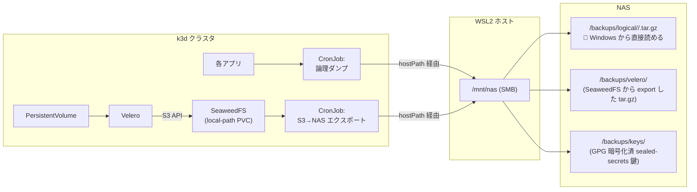

# バックアップ戦略と DR (Disaster Recovery) 手順

[README](../README.md) / [docs/architecture.md](architecture.md) の続編。

**目的**: Windows マシンを買い替えても、Forgejo 上の本リポジトリ + NAS 上のバックアップから完全に復元できる状態を保つ。

---

## 全体方針: 2 層バックアップ



| 層 | 何をバックアップするか | 形式 | 主目的 |
| :--- | :--- | :--- | :--- |
| **層 0: GitOps** | 構成 (Helm values, Application マニフェスト, スクリプト) | Git (Forgejo) | 再構築の手順そのもの。リポジトリ自体は層 1 でダンプ |
| **層 1: 論理ダンプ** | Forgejo データ, PostgreSQL, sealed-secrets 復号鍵 | `.zip` / `.sql.gz` / `.gpg` (Windows から直接読める) | **マシン買い替え時の引き継ぎが主用途** |
| **層 2: Velero スナップショット** | クラスタリソース + PV 一式 | SeaweedFS (local-path) 上の Velero 形式 → S3 API で NAS へ tar.gz エクスポート | 災害復旧 (クラスタごと吹き飛んだ場合) / Point-in-time 復元 |

層 1 だけでも引き継ぎ可能。層 2 は「クラスタ全体を時点指定で巻き戻したい」「PV をまるごと復元したい」要件のための保険。

---

## 層 0: GitOps が前提

クラスタ状態の **構成情報** (Helm values, manifest, スクリプト類) は全て Git にある。新マシンでは Forgejo に push されたこのリポジトリを引き出すだけで構成は再現できる。

Forgejo にしか存在しない情報は層 1 でダンプする (= リポジトリ自身も含む)。

---

## 層 1: 論理ダンプ

「Windows から普通のファイルとして見えるバックアップ」を実現する層。各アプリの公式バックアップ機能を CronJob で叩き、NAS マウントに tar.gz / sql.gz として出力する。

### ディレクトリレイアウト (NAS 上)

```
\\nas\share\local-infra-backups\
├── logical/
│   ├── forgejo/
│   │   ├── forgejo-<TS>.zip            (forgejo dump 出力。リポジトリ・Issue・添付・LFS・DB ダンプ)
│   │   └── ...                         (14 日保持)
│   └── postgres/
│       ├── pg-main-<TS>.sql.gz         (全 DB pg_dumpall)
│       └── ...                         (14 日保持)
├── velero/
│   └── velero-<TS>.tar.gz              (層 2: SeaweedFS から S3 export。30 日保持)
└── keys/
    ├── sealed-secrets-master-<TS>.gpg  (GPG 暗号化済。週次・全世代保持)
    └── ...
```

(Grafana / ArgoCD の個別ダンプは廃止 — 後述の注記参照)

### 各 CronJob の責務 (Phase 6 で実装済み: [manifests/backups/](../manifests/backups/)、`backups` Application)

| 対象 | バックアップ方法 | 周期 | 保持期間 |
| :--- | :--- | :--- | :--- |
| **Forgejo** | `forgejo-dump` CronJob (forgejo ns)。稼働中 pod と data PVC を read-only 共有マウントし `forgejo dump` → zip を NAS へ。app.ini は chart の initContainer が PVC 上に生成済みのものを使う | 毎日 03:00 JST | 14 日 |
| **PostgreSQL** | `postgres-dump` CronJob (postgres ns)。`pg_dumpall --clean --if-exists \| gzip` → NAS へ。接続は CNPG 自動生成の `pg-main-superuser` Secret (cluster.yaml で `enableSuperuserAccess: true`) | 毎日 03:15 JST | 14 日 |
| **sealed-secrets 鍵** | `sealed-secrets-key-backup` CronJob (sealed-secrets ns)。label `sealed-secrets-key=active` の**歴代全鍵**を GPG 対称暗号化 (パスフレーズは `backup-gpg-passphrase` Secret + パスワードマネージャの二重管理) し、ラウンドトリップ復号検証後に NAS へ | 毎週日曜 03:45 JST | 全保持 |
| **復元検証** | `backup-restore-test` CronJob (backups ns)。最新 pg ダンプを使い捨て PostgreSQL に実復元して DB/行数検証 + forgejo zip CRC + 鍵鮮度チェック | 毎月 1 日 07:00 JST | — |

いずれかの Job が失敗すると KubeJobFailed アラート → am-forgejo-bridge が **Forgejo Issue を自動起票**する (Phase 6)。層 2 (Velero) も含めた全定期ジョブの時系列は [docs/scheduled-jobs.md](scheduled-jobs.md) を参照。

> **Grafana / ArgoCD の個別ダンプは廃止** (当初設計から変更、2026-06-13):
> Grafana のダッシュボード・アラート・datasource は Git の provisioning
> (`manifests/monitoring-quality/` + `charts/monitoring/values.yaml`) が真実で、
> 可変状態 (ユーザー・スター等) は pg-main の grafana DB に入り pg ダンプで拾える。
> ArgoCD の Application 群も App-of-Apps (`clusters/home/apps/`) が真実。
> どちらも「Git + pg ダンプ」で完全に再現でき、専用エクスポートは二重管理になるだけ。

注: NAS の hostPath は [bootstrap/01-k3d-cluster.yaml](../bootstrap/01-k3d-cluster.yaml) で**全ノード**に bind mount しているため、ノード固定は不要。鍵ローテーション (controller デフォルト 30 日) で増えた鍵も週次バックアップが毎回全量を拾う。

### Sealed Secrets 鍵の保護

これを失うと **Git にコミットされた全 SealedSecret が復号不能**になる。最重要。

```
クラスタ内 Secret (label sealed-secrets-key=active、歴代全鍵)
   ↓ 週次 CronJob (sealed-secrets-key-backup) が kubectl get → YAML
   ↓ gpg --symmetric --cipher-algo AES256
   ↓ パスフレーズは backup-gpg-passphrase Secret (暗号化側) +
   ↓ パスワードマネージャ (復号側 = DR 用)
sealed-secrets-master-<TS>.gpg
   ↓ NAS の /keys/ へ (全世代保持)
```

パスフレーズの平文は絶対に Git に置かない。**1Password / Bitwarden 等の別系統**で管理する (クラスタ内の `backup-gpg-passphrase` は SealedSecret なので、DR でクラスタが無い状況ではパスワードマネージャ側だけが頼り)。

#### パスフレーズのライフサイクル

- **自動ローテーションはしない (固定 1 本)**。ローテーションするのは sealed-secrets の鍵そのもの (controller が 30 日周期) で、パスフレーズはその封筒として使い回す。
- 各バックアップファイルは**その時点の歴代全鍵の全量スナップショット**なので、DR で使うのは常に最新の 1 ファイルだけ。過去世代はただの冗長コピーであり、「どのファイルがどのパスフレーズか」の対応表は不要。
- パスワードマネージャの登録名は適用開始日付きにする (例: `local-infra backup GPG (2026-06-12〜)`)。ファイル名のタイムスタンプと突き合わせられる。
- **変更手順**: 新パスフレーズ生成 → `backup-gpg-passphrase` SealedSecret を再封入 → パスワードマネージャに新登録を追加 → **次回の週次バックアップが成功した時点で旧パスフレーズ (と旧世代ファイル) は不要になる** (歴代全鍵が新パスフレーズで再収録されるため)。移行期間 (変更〜次の日曜) だけ新旧両方を保持する。
- **復号テスト**: パスフレーズ変更後と半年ごとの DR dry-run 時に、パスワードマネージャから引いた値で最新ファイルの `gpg --decrypt` が通ることを確認する (「覚えているつもり」の排除。[disaster-recovery runbook](runbooks/disaster-recovery.md) の訓練表参照)。鮮度 (<8 日) は月次 restore テストが自動監視する。

---

## 層 2: Velero + SeaweedFS

PV と k8s リソースを丸ごとスナップショットする層。普段は触らない災害復旧用。

SeaweedFS の永続化を **全コンポーネント local-path PVC** にした (2026-05-29 決定) ため、層 2 は 3 段構成になる:

1. **Velero** がクラスタリソース + PV を SeaweedFS の S3 バケットへバックアップ
2. バックアップ実体は SeaweedFS の **local-path PVC (WSL2 ext4)** 上に置かれる
3. **S3→NAS エクスポート CronJob** が SeaweedFS の中身を S3 API (`aws s3 sync` / `weed filer.backup`) で `/mnt/nas/.../velero/` に tar.gz として退避する

なぜ local-path + エクスポートにしたか: SeaweedFS は独自フォーマット (.dat/.idx + leveldb メタ) なので NAS に直接置いても Windows から読めず「丸ごと tar.gz」の旨味が薄い。それより SMB 非依存で起動を安定させ (NAS 断で k3d が落ちない)、NAS への退避は S3 API 層で行う方が Recoverable 原則と整合する。容量が WSL2 ディスクで不足したら csi-driver-smb 移行後に PVC を SMB-backed StorageClass へ差し替える。

### SeaweedFS の構成 (実装済み)

- chart `seaweedfs/seaweedfs` 4.29.0、ArgoCD multi-source (`$values` パターン)
- master / volume / filer すべて local-path PVC (volume 20Gi, master/filer 各 1Gi)
- S3 API は **filer 同居** (`filer.s3`, port 8333)。独立 s3 deployment は無効
- 認証 `enableAuth: true` + `existingConfigSecret: seaweedfs-s3` (admin identity)
- credential は `seaweedfs-s3` SealedSecret (`seaweedfs_s3_config` キーに identities JSON)

### Velero の構成 (実装済み)

- chart `vmware-tanzu/velero` 12.0.1 (Velero 1.18.0)、ArgoCD multi-source (`$values` パターン)
- plugin `velero-plugin-for-aws` **v1.14.1** (velero 1.18 対応)、initContainer で注入。
  ※ velero ↔ plugin のバージョン不一致は BSL 接続失敗の主因なので厳守
- **PV は node-agent (kopia FSB)** でバックアップ (`deployNodeAgent: true` / `defaultVolumesToFsBackup: true`)。local-path が CSI snapshot 非対応のため。`snapshotsEnabled: false`
- BSL: provider aws, bucket `velero`, `s3Url=http://seaweedfs-s3.seaweedfs.svc.cluster.local:8333`, `s3ForcePathStyle: true`
- credential は admin identity 流用の aws 形式 SealedSecret (`velero-credentials`)
- velero バケットは `manifests/seaweedfs/create-buckets-job.yaml` (通常 Job + syncOption `Replace=true` の冪等 Job、バケット存在チェック付き) で作成。filer.s3 は values の createBuckets 非対応のため。プラットフォーム固定バケットはこの Job に集約し、アプリのセルフサービス用バケットは将来 Crossplane/COSI など別レイヤで扱う
- スケジュール `0 4 * * *` (**UTC** = 13:00 JST。層 1 の後)、保持 720h (30 日)、`seaweedfs`/`kube-system`/`kube-public` は除外

### S3→NAS エクスポート (実装済み)

- `manifests/velero-export/export-cronjob.yaml` の CronJob `velero-s3-nas-export`
  (velero namespace)。ArgoCD App は `clusters/home/apps/velero-export.yaml`
- 処理: `aws s3 sync s3://velero <work> --delete` → `tar czf` で
  `/mnt/nas/local-infra-backups/velero/velero-<TS>.tar.gz` に退避 → 30 日超を削除
- スケジュール `0 5 * * *` (**UTC** = 14:00 JST。Velero backup `0 4` UTC + 層 1 論理ダンプ `0 3` JST 台の後)
- credential は同 ns の `velero-credentials` SealedSecret (`cloud` キーの aws profile
  形式) を Secret volume で `/root/.aws/credentials` にマウントして流用。SeaweedFS は
  path style 必須なので `AWS_S3_ADDRESSING_STYLE=path` を明示
- 冒頭で NAS 書き込み可否を pre-check し、SMB 断 (既知の弱点) を Job 失敗として顕在化
- `concurrencyPolicy: Forbid` で重複起動を防ぐ。これにより層 2 も「NAS にあるものから
  復元」原則を満たす

### Velero でやれること

```bash
# バックアップ一覧
velero backup get

# クラスタ全体 (除外あり) の即時バックアップ
velero backup create manual-$(date +%s) \
  --exclude-namespaces=kube-system,seaweedfs

# 特定 namespace のみ復元
velero restore create --from-backup <name> --include-namespaces=forgejo
```

---

## マシン買い替え時の引き継ぎ手順

**実行手順書は [docs/runbooks/disaster-recovery.md](runbooks/disaster-recovery.md) (Phase 6 で詳細化)**。以下は設計当初の概要フロー (アウトラインとして残置。実際のコマンド・順序は runbook が真実。特に現在は Forgejo が pg-main に依存するため、CNPG → pg 復元 → Forgejo の順で bootstrap する点が下記と異なる)。

新しい Windows PC でフルスタックを復元する標準フロー。**全部で 2-3 時間が目安**。

### 必要なもの

- 新 PC (メモリ 32GB 以上推奨)
- NAS への接続情報 (アカウント・パスワード)
- sealed-secrets 鍵 GPG ファイルのパスフレーズ (脳内 / パスワードマネージャ)
- Forgejo 管理者アカウントのパスワード

### 手順

```
[step 1] 前提環境のインストール (30 分)
  - Windows 11 セットアップ
  - WSL2 / Ubuntu 24.04 インストール
  - Podman / kubectl / helm / k3d インストール
  - WSL2 から NAS を SMB マウント (/mnt/nas)
  → bootstrap/00-prerequisites.md に従う

[step 2] リポジトリ取得 (5 分)
  - 新 PC でまずは Forgejo を立てる必要があるため、本リポジトリは GitHub ミラー (or NAS の最新 forgejo dump 内) から取得
  - git clone <一時ソース> ~/local-infra

[step 3] k3d クラスタ起動 (5 分)
  k3d cluster create --config bootstrap/01-k3d-cluster.yaml

[step 4] ArgoCD を手動 helm install (5 分)
  bash bootstrap/02-argocd-install.sh

[step 5] sealed-secrets コントローラを先行投入し、鍵を復元 (10 分)
  - kubectl apply で sealed-secrets controller を起動 (まだ鍵は無い)
  - NAS の sealed-secrets-master.key.gpg を取得
  - gpg --decrypt → sealed-secrets-key.yaml
  - kubectl apply -f sealed-secrets-key.yaml
  - kubectl rollout restart deploy sealed-secrets -n kube-system
  → これで Git 内の全 SealedSecret が復号可能になる

[step 6] root Application を適用 (5 分 + 自動同期 15-30 分)
  kubectl apply -f bootstrap/03-root-app.yaml
  → ArgoCD が Forgejo, PostgreSQL, ... を順次デプロイ

[step 7] Forgejo 復元 (15-20 分)
  - Pod 起動を確認
  - NAS の最新 forgejo dump zip を取得
  - ※ forgejo に restore サブコマンドは無い。zip を展開して
    repos/ → /data/git/repositories、data/ → /data/gitea に書き戻し、
    `forgejo admin regenerate hooks` を実行する (詳細は runbook)
  - リポジトリ・Issue・PR がすべて戻る (DB は step 8 の pg 復元側)

[step 8] PostgreSQL 復元 (10 分)
  - 最新 sql.gz を NAS から取得
  - kubectl exec -n postgres <pod> -- bash -c "gunzip -c /mnt/nas/.../postgres/<latest>.sql.gz | psql -U postgres"

[step 9] Grafana / ArgoCD のメタデータ復元 (5 分)
  - JSON / YAML から再 import (スクリプト化予定)

[step 10] root Application の repoURL を Forgejo 内部 Service に向け直す (5 分)
  - 一時的に外部リポジトリを指していた repoURL を、Forgejo 内 URL に変更
  - git commit & push → ArgoCD が自動収束

[step 11] 動作確認チェックリスト (15 分)
  - argocd.local.test ログイン可
  - forgejo.local.test に過去リポジトリ存在
  - grafana.local.test にダッシュボード存在
  - quality-agent のサンプル評価が成功
```

このフローは **半年に 1 回 dry-run** することを推奨 ([docs/runbooks/disaster-recovery.md](runbooks/disaster-recovery.md) として詳細化済み。月次の自動 restore テストとは別に、年 2 回は人間が通す)。

---

## バックアップが壊れないための運用

| 観点 | 対策 |
| :--- | :--- |
| **NAS マウント断** | 全バックアップ CronJob が冒頭で `/mnt/nas` の write 可否を pre-check して即失敗 → KubeJobFailed → am-forgejo-bridge が Forgejo Issue 自動起票 (Phase 6 実装済み) |
| **NAS ディスク障害** | NAS 側 RAID 構成を信頼。ただし論理ダンプは月 1 で外付け HDD にもコピー (手動運用) |
| **論理ダンプの検証** | `backup-restore-test` CronJob (毎月 1 日 07:00 JST) が最新ダンプを使い捨て PostgreSQL に実復元して検証 (Phase 6 実装済み) |
| **鍵ローテーションの取りこぼし** | controller は 30 日で sealing key を増やす。週次バックアップが label 一括取得で**歴代全鍵**を毎回収録 |
| **保持期間オーバーフロー** | 各 CronJob 末尾で `find ... -mtime +N -delete` |
| **sealed-secrets 鍵紛失** | GPG パスフレーズはパスワードマネージャと印刷物の二重管理。半年ごとの DR dry-run で「復号できること」まで確認 |

---

## やらないこと (スコープ外)

- WSL2 ディスクイメージ全体のスナップショット (容量爆発 + GitOps と二重管理になる)
- クラスタ間レプリケーション (個人 1 クラスタなので不要)
- 暗号化 at-rest を NAS 経路まで強制 (sealed-secrets 鍵を除く。LAN 内なので妥協)
- バックアップの世代別オフサイト保管 (運用負荷に対しリスク便益が低い)

これらは将来必要になった時点で再検討する。

---

## 関連ドキュメント

- [README](../README.md)
- [アーキテクチャ](architecture.md)
- [品質モデル](quality-model.md)
- [定期ジョブ一覧 (1 日のタイムライン)](scheduled-jobs.md)
