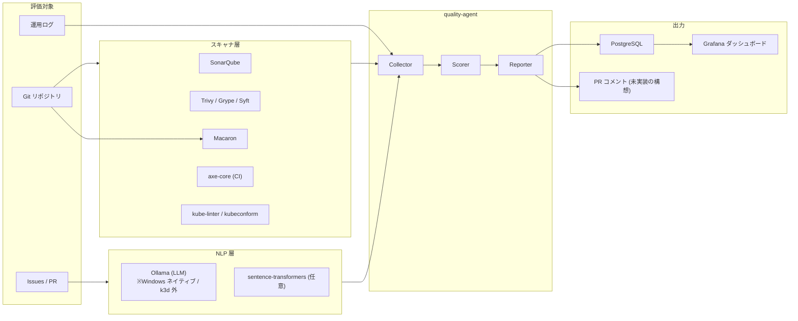

# 品質モデル: ISO/IEC 25010:2023 + 25019:2023 → 実装ツール対応

本ドキュメントは [iso-quality-framework.md](iso-quality-framework.md) の規格・理論モデルを、本リポジトリの実装スタックに具体マッピングする。

[README](../README.md) / [docs/architecture.md](architecture.md) の前提知識を持つ前提で記述する。

> **実装状況の注記** (2026-06-13): 本書のマッピング表は**目標とするフルセット**を示す。Phase 4〜6 で実装済みなのは security (Trivy CVE + Macaron SLSA)、maintainability (SonarQube)、reliability / performance / safety (kube-linter)、interaction (Ollama による docs LLM 評価)、QiU の beneficialness / acceptability (Forgejo API メタデータ) で、CoU 重みのある特性はカバレッジ 1.0。表中のその他のツール (Grype / Syft / axe-core / Semgrep / openapi-diff 等) は**未導入の構想**であり、拡張時の候補リストとして残している。実装済みの経路は [README の進捗ステータス](../README.md#進捗ステータス) が真実。

---

## 全体像



---

## ISO/IEC 25010:2023 製品品質モデル → 実装

9 特性すべてを対象とする。temp.md の表を実装ツール列付きに再構成。

| 品質特性 | 副特性 (抜粋) | 解析対象 | 主使用ツール | quality-agent での処理 |
| :--- | :--- | :--- | :--- | :--- |
| **機能適合性** | 機能網羅性 / 機能正確性 / 機能妥当性 | テストコード, OpenAPI スキーマ, 要件 Markdown | SonarQube (カバレッジ), 各言語テストフレームワーク (JUnit XML), `openapi-diff` | 要件文書から抽出した機能エンティティとテスト名を Ollama でセマンティック照合し、カバレッジ穴を検出 |
| **性能効率性** | 時間特性 / 資源利用性 / 容量 | クエリ, k8s manifest の resource limits, 負荷試験ログ | SonarQube (Hotspot), `sqlcheck` (N+1 検出), k6 / Locust (Phase 5 で導入検討) | リソース limit 未設定の Pod 検出、N+1 候補のヒューリスティック計数 |
| **互換性** | 共存性 / 相互運用性 | Helm values, OpenAPI 差分 | `openapi-diff`, `kubeconform`, Trivy IaC | API 破壊的変更の検出と、PR コメント自動投下 |
| **相互作用性** | 適切性識別性 / インクルーシブ性 / ユーザアシスタンス / 自己記述性 | フロントエンドコード, CLI ヘルプ, エラーメッセージ | `axe-core` (CI), `pa11y`, ESLint a11y プラグイン | WCAG 違反件数、エラーメッセージの存在確認 (Ollama によるヒューリスティック評価) |
| **信頼性** | 無欠陥性 / 稼働性 / フォールトトレランス / 回復性 | 例外処理, リトライ構成, k8s probes | Semgrep (空 catch ルール), `kube-linter`, Prometheus 稼働率メトリクス | Liveness/Readiness Probe 未設定 Pod 数、空 catch 検出件数、過去 N 日のアラート発火数 |
| **セキュリティ** | 機密性 / 完全性 / 否認防止性 / 真正性 / **耐性** (2023 新設) | ソースコード全体, SBOM, 署名 | `trufflehog` / `gitleaks` (Secrets), Trivy / Grype (CVE), Syft (SBOM), Macaron (SLSA) | CVE 件数の重大度別集計、SLSA レベル判定、シークレット検出のゼロ確認 |
| **保守性** | モジュール性 / 再利用性 / 解析性 / 修正性 / 試験性 | ソース全体 | SonarQube (複雑度・凝集度・カバレッジ), `radon` (Python), `gocyclo` (Go) | 循環的複雑度のしきい値超過関数数、技術的負債比 (SonarQube) |
| **柔軟性** | 環境適応性 / **スケーラビリティ** / インストール容易性 / 置換容易性 | Terraform / Helm / HPA, 環境変数の外部化 | `kube-linter`, `polaris`, `tflint`, Helm chart linter | HPA 未設定 Workload 数、ハードコードされた接続情報の検出 |
| **安全性** (2023 新設) | 運用制約 / リスク識別 / フェイルセーフ / 危険警告 / 安全統合 | 例外安全コード, Seccomp/AppArmor, シャットダウンフック | Semgrep カスタムルール, `kube-bench`, `kube-linter` (security context) | `securityContext` 不在 Pod 数、Graceful Shutdown 実装の Ollama によるパターン検出 |

### 評価ロジックの実装方針

- **ルールベースで取れるものはすべてルールベース**で取り、ツール出力 (SARIF / JSON / JUnit XML) を `quality-agent/collectors/` が正規化する。
- **Ollama を使うのは「意味理解」が必要な箇所のみ**: 要件 ↔ テストの意味マッチ、エラーメッセージの親切さ、Graceful Shutdown パターンの認識、など。
- **しきい値はプロジェクト単位で `quality-agent/policies/<project>.yaml` に外出し**し、Git 管理する。

---

## ISO/IEC 25019:2023 利用時の品質 (QiU) → 実装

3 主要特性 × Gitメタデータの NLP マイニングで定量化する。

| 特性 | サブ特性 (抜粋) | データソース | 評価アプローチ |
| :--- | :--- | :--- | :--- |
| **有益性** (Beneficialness) | 有効性 / 効率性 / 満足性 | Forgejo Issues, PR コメント, (任意) ユーザーフォーラムの RSS | Ollama によるセンチメント分類 (positive/neutral/negative)、フラストレーション関連語彙の頻度集計、Issue クローズまでの中央時間 |
| **リスク回避性** (Freedom from Risk) | 身体的・経済的・環境/社会的リスク | バグ報告 Issue, Security Advisory, Prometheus アラート履歴, Velero リストアログ | 「データ喪失」「漏洩」「停止」キーワードの分類、Mean Time to Resolution (MTTR) 計算、Severity 別件数 |
| **受容性** (Acceptability) | 信頼 / 受容・導入容易性 | Issue クローズ率, PR レビュー速度, スター数 (Forgejo にもある), 依存被参照数 | 機能要求 vs 実装の比率、PR 初回反応時間中央値、依存パッケージとしての利用記録 |

### 利用コンテキスト (Context of Use, CoU) の管理

ISO/IEC 25019:2023 は「コンテキスト前提が変われば QiU 要件も再定義」を要求する (temp.md 21 文献)。本実装では:

```yaml
# quality-agent/contexts/<project>.yaml
context_id: home-monitoring-app
stakeholders:
  primary: 自宅サーバー管理者 (本人)
  secondary: 家族 (閲覧のみ)
use_cases:
  - 自宅 IoT 機器の稼働監視
  - 月次レポートの閲覧
environments:
  - WSL2 + k3d (本リポジトリ)
constraints:
  safety_level: low      # 人命に関わらない
  uptime_requirement: 95% # 個人運用許容
  data_sensitivity: medium
weights:                  # トレードオフ評価に使う
  security: 0.20
  reliability: 0.20
  maintainability: 0.30
  performance: 0.10
  usability: 0.20
```

これを quality-agent の入力にして、**プロジェクトごとに重み付け済み総合スコアを算出**する。CoU を変更した場合は履歴を残し、スコア比較時にコンテキスト変化を考慮できるようにする。

### NLP 評価で気をつけること

- ローカル LLM (7B-13B) の感情分析精度は商用 LLM より下がる。**絶対評価ではなく時系列の相対変化**を見る前提で設計する。**モデルを差し替える (例: Qwen→Gemma) と基準線がズレる**ため、モデル変更イベントを記録して時系列の断絶を識別できるようにする。
- Ollama は **Windows ネイティブで稼働** (k3d 外)。quality-agent は in-cluster の `ollama-external` 経由で HTTP 接続する。デプロイ・接続の詳細は [architecture.md#ollama-windows-ネイティブ-接続](architecture.md)。
- プロンプトは `quality-agent/prompts/` に英日両対応で置き、Issue 言語によって切り替える。
- **少サンプル時の過剰反応を抑える**: 件数下限 (例: 過去 30 日で 10 件未満) の場合はスコアではなく "insufficient data" を返す。

---

## quality-agent の処理パイプライン

nightly CronJob `quality-agent-nightly` (quality-agent ns、毎日 06:00 JST) が以下を実行する (当初案の Forgejo Actions トリガは、Runner 不要の CronJob 方式に Phase 4 で変更):

```
1. trigger: nightly cron (06:00 JST。SonarQube 解析は前段の sonar-scan-nightly 05:15 JST が投入済み)
   ※ initContainer: リポジトリ clone + Macaron による SLSA 監査
2. quality-agent collect
   ├ ソース静的解析 (SonarQube Web API: 技術的負債比・重複行密度)
   ├ 脆弱性 (trivy-operator の VulnerabilityReport 集計)
   ├ サプライチェーン (Macaron レポートの check 通過率)
   ├ k8s manifest lint (kube-linter: probe / resource / securityContext)
   ├ docs の LLM 評価 (Ollama: 自己記述性・ユーザアシスタンス等)
   └ Forgejo メタデータ (Issue / PR via API: クローズ率・滞留など)
3. quality-agent analyze
   ├ ルールベース集計 (Python)
   └ Ollama にプロンプト送信 (LLM-as-judge)
4. quality-agent score
   ├ ISO 25010 各特性スコア
   ├ ISO 25019 各特性スコア
   └ CoU 重み付け総合スコア
5. quality-agent report
   └ PostgreSQL (pg-main の quality DB) に時系列で保存
      → 可視化・劣化検知は Grafana provisioning 側 (docs/runbooks/quality-observability.md)
```

全サブコマンドは単一イメージ (`quality-agent/Dockerfile`、Forgejo レジストリから配布) に同梱し、CronJob が順に実行する。PR / Commit へのコメント投下は未実装の構想 (現状の通知経路はアラート → am-forgejo-bridge の Issue 起票)。

---

## トレードオフ評価

temp.md の「品質特性間の相互干渉マトリクス」を、agent が内部ルールとして保持する。

| 起点 | 正に作用 | 負に作用 | 検出ロジック例 |
| :--- | :--- | :--- | :--- |
| セキュリティ:耐性 ↑ | 信頼性:回復性 | 性能:時間特性 | mTLS 有効化 PR で平均 latency メトリクスが N%以上劣化したら警告 |
| 柔軟性:スケーラビリティ ↑ | 性能:容量 | 保守性:解析性 | マイクロサービス分割直後に SonarQube 複雑度合計が増加していないかを確認 |
| 保守性:モジュール性 ↑ | 保守性:試験性 | 性能:資源利用 | モジュール分割 PR で Pod 数増 × 平均メモリの積を観測 |
| GenAI 利用増 | 開発速度 | 受容性:信頼 | コミット速度の急増と、その後 N 日の revert / hotfix 率の相関を計算 |

PR 単位でトレードオフ違反候補を検出し、 `quality-agent` がレビューコメントとして警告を残す。**最終判断は人間** (個人運用なので自分)。

---

## スコアモデル方針 (素案)

各特性は **0-100** の正規化スコア。算出は:

```
score(characteristic) =
   weight_subchar_1 * normalize(metric_1)
 + weight_subchar_2 * normalize(metric_2)
 + ...
```

`normalize` は以下の方式から特性別に選択:

- **線形**: しきい値 [bad, good] を直線補間
- **対数**: 件数系 (CVE 数, バグ数) は log スケール
- **二値**: 「存在/不在」(probe 設定, セキュリティポリシ) は 0/100

CoU 重みで加重平均して総合スコアを出す。スコア定義の妥当性は temp.md 文献 [20] (MDPI) などの先行研究を参考に調整する。

---

## 関連ドキュメント

- [アーキテクチャ](architecture.md)
- [バックアップ戦略](backup.md)
- [ISO/IEC 規格と理論的根拠](iso-quality-framework.md)
